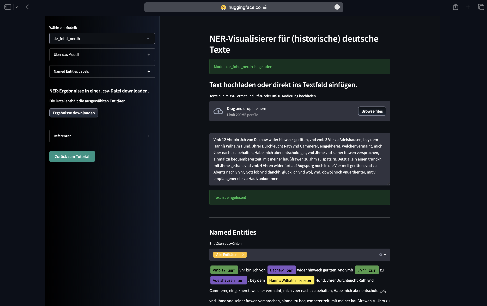

# **NerDH Visualisierer**

Der Abschluss des Tutorials stellt der NerDH-Visualisierer dar. Er kommt mit einer einfachen und leicht zu bedienenden Benutzeroberfläche, um einen Text schnell auf seine Named Entities zu untersuchen. Der Visualisierer wurde mit dem Open Source App Framework `streamlit` erstellt.

??? Streamlit question

    Streamlit konvertiert pythonbasierte Datenskripte zu Webanwendungen und hostet sie dabei kostenlos. Möglich ist dies durch die Verknüpfung mit einem Github Repository.[^1] 

Neben dem selbst trainierten `de_fnhd_nerdh` Modell, wurden dem Visualisierer auch die drei deutschen `spaCy` Sprachpakete implementiert. Somit kann ein Text mit vier verschiedenen NER-Modellen getestet und auf seine unterschiedlichen Ergebnisse hin verglichen werden. Zusätzlich gibt es über jedes Modell Informationen und eine Übersicht über die Named Entities Typen. 

!!! info "Das Modell `de_fnhd_nerdh`"
    Es sollte klar sein, dass das selbst erstellte Modell `de_fnhd_nerdh` besonders gut mit Texten von **Philipp Hainhofer** funktioniert (F-Score 0.92), da es mit diesen trainiert wurde. Nur weil ein Text in frühneuhochdeutsch geschrieben wurde, ist dies keine Garantie für ein gutes Ergebnis mit diesem Modell. Der Grund: Historische Texte sind zu spezifisch, als dass sie in einem Modell zusammengefasst werden könnten. 

Der zu analysierende Text kann einfach ins Textfeld reinkopiert werden oder aber - sofern im .txt-Format vorliegend - hochgeladen werden. Der NER-Prozess startet sobald der Text erfolgreich eingelesen wurde. Mittels der `displacy`-Funktion von `spaCy` werden die Named Entities visuell übersichtlich dargestellt. Abgerundet wird der NerDH Visualisierer durch die Download-Funktion der NER-Ergebnisse. 


Der NerDH Visualisierer kann zum einen im **Browser** direkt besucht werden oder aber **lokal** auf dem Computer.

**Viel Spaß damit!** 
<br>
<br>


=== "Browser"

    Der NerDH Visualisierer wird nicht direkt mit `streamlit` gehostet, da die CPU und Speicherkapazitäten der Streamlit Cloud für den NER-Prozess der vier Modelle nicht ausreichend ist. Daher wird der Visualisierer auf `Hugging Face` gehostet. 

    ??? question "Hugging Face"
        
        Hugging Face ist eine Community- und Data-Science-Plattform, auf welcher Open-Source Projekte wie Machine-Learning Modelle, Datensets oder Web-App-Anwendungen frei publiziert werden können. Der Aufbau dazu ist ähnlich zu einem Github Repository. Streamlit Projekte können hier in sogenannten **Spaces** hochgeladen werden.[^2] 


    [Hier geht es zum NerDH Visualisierer auf Hugging Face](https://huggingface.co/spaces/easyh/NerDH_Visualisierer){ .md-button }


    Falls der Visualisierer längere Zeit nicht benutzt wurde, muss sich dieser erst wieder zusammenbauen. Das kann einen Moment dauern, da hier die Sprackpakete erneut heruntergeladen werden müssen. An `Running`, `Building` und `Stopped` ist der aktuelle Status der App zu erkennen. Nachdem `Restart Space` gedrückt wurde, sollte die Seite nach einer kurzen Zeit nochmal neu aktualisiert werden.

    <br>

     <figure markdown>
    { width="800" }
    <figcaption style="font-size: 0.8em;">NerDH Visualisierer in Browser Ansicht.</figcaption>
    </figure>

=== "Lokal"

    Um die App lokal zu verwenden, muss das Github-Repository [:fontawesome-brands-github: easyh/NerDH](https://github.com/easyh/NerDH) heruntergeladen werden.

        git clone https://github.com/easyh/NerDH.git


    Dann müssen - sofern noch nicht im Tutorial erfolgt -die entsprechenden Python-Pakete und die Sprachmodelle der `requirements.txt` lokal auf der Maschine installiert werden. 

    ??? note "Python Pakete und NER-Sprachmodelle installieren"

        Befehle nacheinander ausführen:

        ``` py
        pip install streamlit 
        ```
        ``` py
        pip install spacy
        ```
        ``` py
        pip install spacy-streamlit 
        ```
        ``` py
        pip install pandas
        ```
         
        NER-Modell de_history_md installieren:

            pip install https://huggingface.co/easyh/de_fnhd_nerdh/resolve/main/de_fnhd_nerdh-any-py3-none-any.whl 
        
        Spacy NER-Modelle installieren:

        ``` py
        python -m spacy download de_core_news_sm
        ```
        ``` py
        python -m spacy download de_core_news_md
        ```
        ``` py
        python -m spacy download de_core_news_lg
        ```
    
        !!! info "Speichergröße der Sprackpakete"
            
                `de_fnhd_nerdh`: 586MB`, `de_core_news_sm: 13MB`, `de_core_news_md: 42MB`, `de_core_news_lg: 541MB`

    Jetzt muss nur noch in den entsprechenden Ordner navigiert werden. 

        cd nerdh_visualisierer

    Danach muss nur noch folgender Befehl einmal ausgeführt werden. 

        streamlit run app.py

    Die App wird sich automatisch im Browser unter `localhost` öffnen. Das kann einen kleinen Moment dauern. Das Ganze sollte dann in etwa so aussehen: 

    <br>

    <figure markdown>
    { width="800" }
    <figcaption style="font-size: 0.8em;">NerDH Visualisierer in lokaler Ansicht. Die lokale Ansicht unterscheidet sich etwas zu der im Browser, da Hugging Face keine individuellen Desing-Anpassungen zulässt.</figcaption>
    </figure>


<br>

[^1]: Streamlit. The fastest way to build and share data apps. (o. D.). [https://streamlit.io/](http://web.archive.org/web/20221229080207/https://streamlit.io/)
[^2]: Hugging Face. The AI community building the future. (o. D.). [https://huggingface.co/](http://web.archive.org/web/20230102125618/https://huggingface.co/) 


